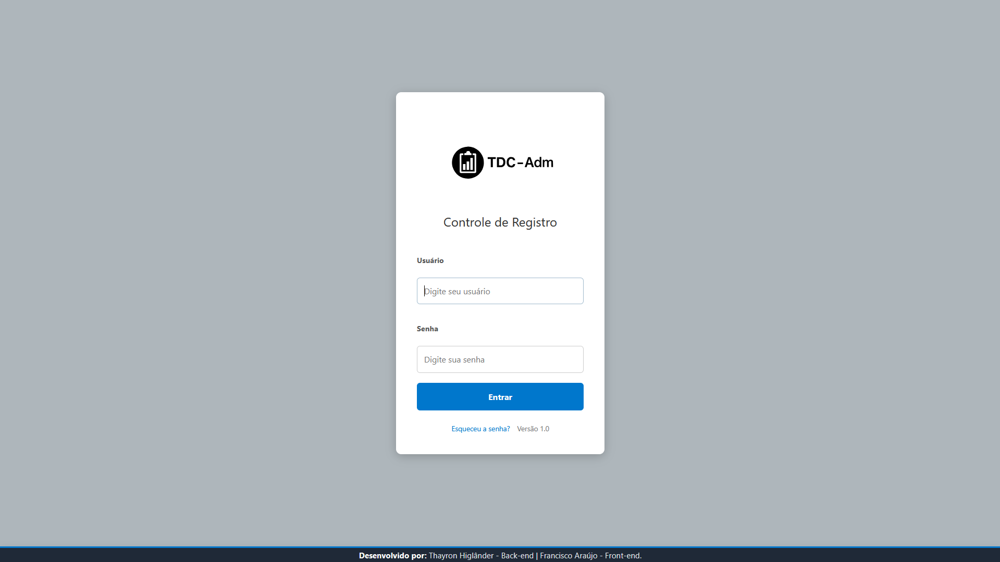
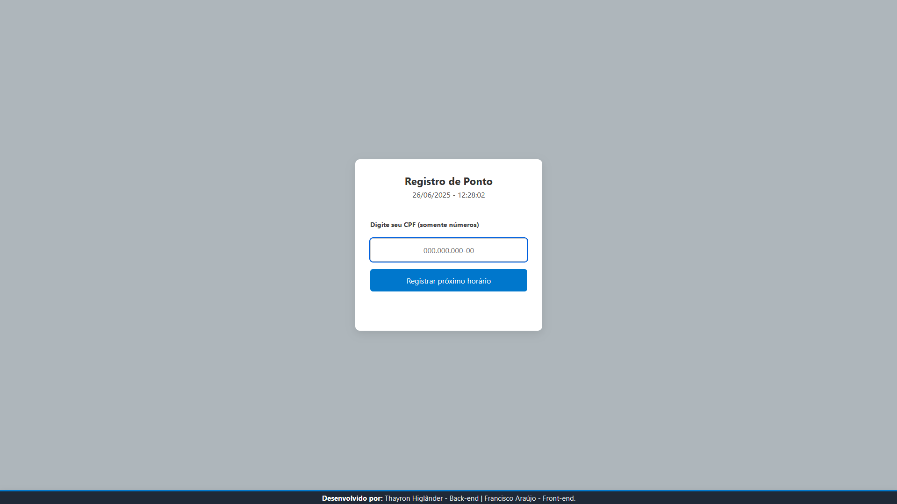
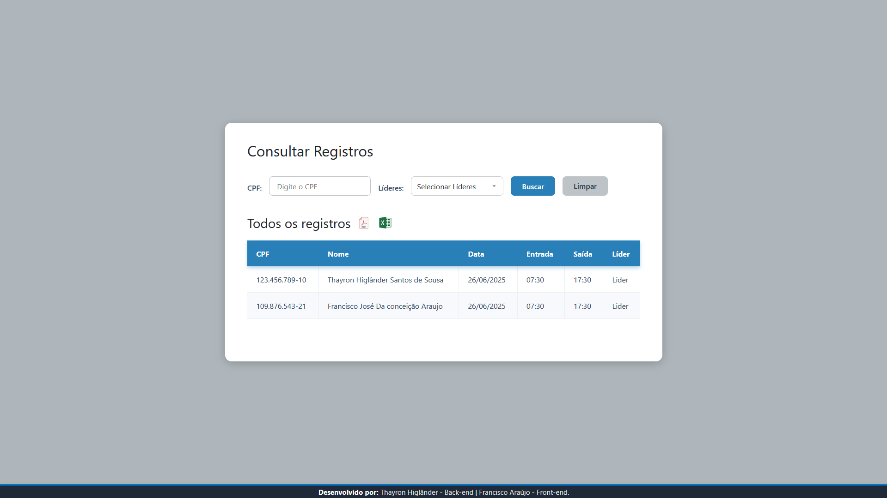
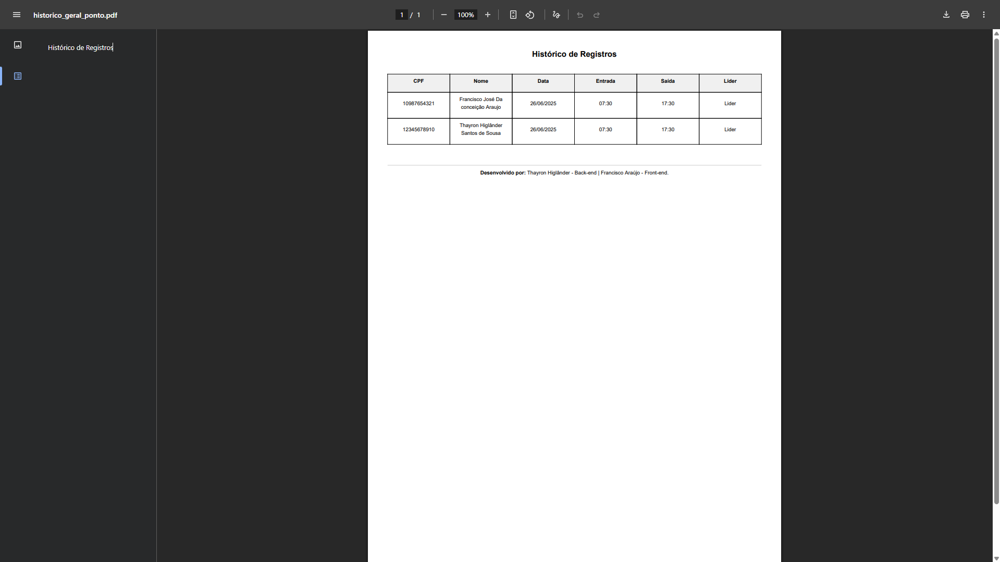
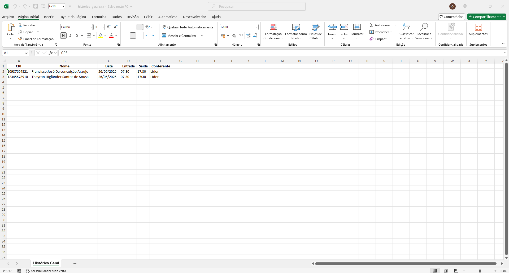

# ⏱️ Sistema de Registro


Este é um sistema web de **registro digital** desenvolvido com **Django**, que permite que colaboradores registrem suas entradas e saídas, e gerentes acompanhem os históricos por meio de relatórios em **PDF** e **Excel**. O sistema é seguro, intuitivo e possui controle de acesso por níveis de usuário.

---

## 🚀 Funcionalidades

### 👤 Área do Colaborador
- Registro de ponto com CPF.
- Armazena horário da **entrada e saída** no mesmo dia.
- Validação de CPF com feedback direto na interface.
- Associado a um **líder**, para rastreabilidade futura.

### 🧑‍💼 Área do Gerente
- Acesso restrito apenas a usuários com nível `gerente`.
- Listagem de todos os registros de ponto.
- Filtros por CPF e por líder responsável.
- Exportação do histórico completo em:
  - 📄 **PDF**
  - 📊 **Excel**

### 🔐 Sistema de Autenticação
- Login e logout de usuários.
- Níveis de permissão:
  - Usuário padrão – registra ponto.
  - Gerente – acesso total ao sistema e relatórios.

---

## 🏗️ Estrutura do Projeto

### 🧍 Relacionamentos
- Um `Líder` pode ter vários colaboradores.
- Cada `Colaborador` pode registrar ponto diariamente.
- O nome do líder é armazenado no momento do registro, para manter o **histórico congelado**.

### 📁 Exportações
- PDF com layout limpo e pronto para impressão, (gerado com `xhtml2pdf`).
- Excel com colunas autoajustadas e horários formatados, (gerado com `openpyxl`).

---

## 📷 Telas Principais

### 🔐 **Tela de Login**



> Usuários acessam com login e senha.  
> Redirecionamento automático:
> - Usuários padrão → Registro de Ponto  
> - Gerentes → Painel Administrativo
---

### 🕘 **Registro de Ponto com CPF**



> Tela acessível a todos os usuários padrão. Ideal para uso rápido com leitores de cartão ou coletores.


#### ⚙️ Funcionamento:
- O colaborador digita o **CPF** e o sistema registra automaticamente (sem pressionar Enter).
- Lógica inteligente:
  - Se ainda não houver ponto, registra **entrada**.
  - Se já houver entrada, registra **saída**.
  - Se registrar após entrada e saída, exibe **mensagem informando que o ponto do dia já foi registrado**.
- Possui **tempo de resfriamento de 10 segundos** para o mesmo CPF, evitando registros duplicados por engano.
- Outros CPFs podem ser registrados sem esperar.

---

### 📋 **Listagem Gerencial com Filtros**



> Interface exclusiva para gerentes, com recursos de busca e relatórios.

#### Recursos:
- Filtros combináveis:
  - CPF do colaborador
  - Líder responsável
- Botões para:
  - 📄 Exportar em PDF
  - 📊 Exportar em Excel
---

### 📤 **Download de Relatórios (PDF e Excel)**

> Acesso exclusivo para gerentes.  
> Os relatórios são baixados através de botões de exportação visíveis na interface.

#### 📄 Relatório em PDF


> Documento limpo e formatado para impressão ou arquivamento.

---

#### 📊 Relatório em Excel


> Planilha pronta para análises em BI ou integração com outros sistemas.


## 💻 Tecnologias Utilizadas

### 🖥️ Front-end
- **HTML5**
- **CSS3**
- **JavaScript**

### 🧠 Back-end
- **Python 3.10+**
- **Django 4.x** – views, models, templates, autenticação
- **AbstractUser** – controle de permissões personalizadas

### 📄 Geração de Relatórios
- **xhtml2pdf** – geração de arquivos PDF
- **openpyxl** – criação de planilhas Excel

---

## 🧪 Como Executar Localmente

```bash
# Clone o projeto
git clone https://github.com/devthayron/registrar_ponto.git

# Crie e ative o ambiente virtual
python -m venv venv
source venv/bin/activate  # Linux/macOS
venv\Scripts\activate     # Windows

# Instale as dependências
pip install -r requirements.txt

# Realize as migrações
python manage.py makemigrations
python manage.py migrate

# Crie um superusuário
python manage.py createsuperuser

# Inicie o servidor
python manage.py runserver
````

---

## 🔮 Melhorias Futuras

* Filtro por intervalo de datas
* Registro via QR Code
* Dashboard com gráficos e estatísticas
* Exportação por período
* Integração com APIs externas (ex: folha de pagamento)

---

## 🤝 Contribuição

Pull requests são bem-vindos! Para mudanças maiores, abra uma issue antes para discutir o que você gostaria de modificar.

---

## 🧑‍💻 Autores

- **Thayron** (Back-end) – [LinkedIn](https://www.linkedin.com/in/thayron-higlander)  
- **Francisco** (Front-end) – [LinkedIn](https://www.linkedin.com/in/francisco-araujo)
